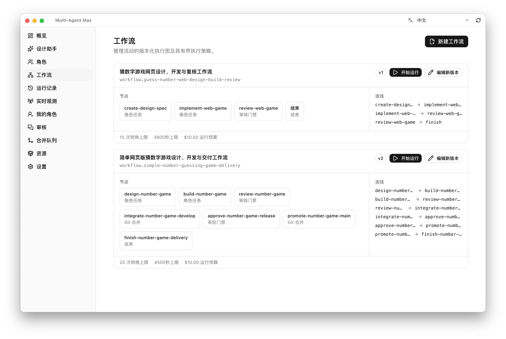
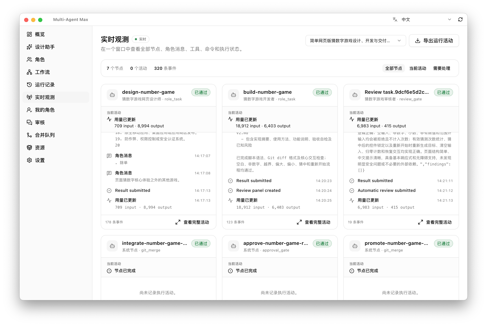
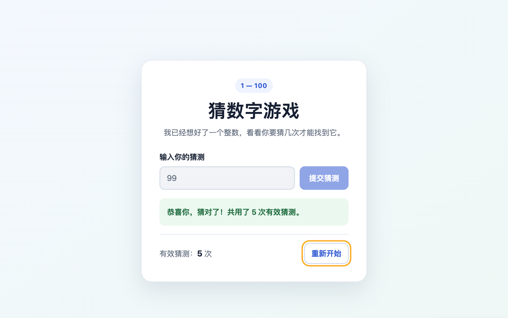

# Multi-Agent Max

[简体中文](README.md) | [English](README.en.md)

Multi-Agent Max (MAM) is a local, Git-driven desktop control plane for user-defined multi-agent
workflows. It turns versioned roles, workflow graphs, isolated Git worktrees, immutable attempt
evidence, reviews, and deterministic integration into one auditable delivery loop.

MAM is not an agent runtime or a remote-machine manager. It coordinates structured executors while
Git remains the authority for shared workflow state.

> [!IMPORTANT]
> MAM is under active development (`0.1.0`). macOS is the first supported release target. The
> current application executes production attempts through Pi RPC only; Codex CLI and Grok CLI
> adapters remain in the repository for later activation.

## What it provides

- **User-defined roles** — Versioned Role Profiles combine an executor, model, prompt, Skills, MCP
  servers, knowledge bases, tools, permissions, budgets, retry policy, and context policy.
- **Visual workflows** — Create and edit graphs containing role tasks, dynamic tasks, reviews,
  approvals, conditions, parallel branches, joins, artifact transforms, commands, Git merges, and
  bounded rework loops.
- **Design Assistant** — Use an existing Model Profile to clarify requirements, compare approaches,
  review a generated design section by section, and create new role and workflow definitions after
  explicit confirmation. Drafts stay local, do not read project files automatically, and never
  start a run or task when applied.
- **Fixed execution semantics** — Every executable workflow node binds exactly one role at design
  time. Tasks inherit that role and cannot be reassigned while a run is in progress.
- **Git-authoritative collaboration** — Append-only events live on an independent `mam-state`
  branch. A configured remote enables collaboration across clones; a local-only repository supports
  multiple roles on one machine.
- **Isolated attempts** — Code attempts run in dedicated branches and worktrees with a frozen
  effective configuration, structured results, immutable artifacts, and complete lineage.
- **Review and integration** — Review decisions attach to exact attempts and commits. The merge
  queue uses stable ordering, reruns validation in an integration worktree, and records conflict
  resolution lineage.
- **Recovery and diagnostics** — Rebuild projections from Git, preserve attempt history across
  retries, reconcile unknown side effects, and export correlated diagnostics without persisting
  plaintext secrets.
- **Bilingual desktop UI** — Switch between English and Simplified Chinese from the application
  header.

## Sidebar features

| Feature | What it does |
| --- | --- |
| **Overview** | Connect or switch Git projects and see active roles, workflows, runs, merge entries, and authoritative-state issues that require attention. |
| **Design Assistant** | Use an existing Model Profile for a local multi-turn conversation that clarifies requirements, compares approaches, finds workflow defects, and confirms the design section by section. Applying a design creates new roles and a workflow, or the next version of an existing workflow, without starting a run or task. |
| **Roles** | Create and manage versioned Role Profiles that combine an executor, model, system prompt, Skills, MCP, knowledge bases, permissions, budgets, retry policy, and context policy. |
| **Workflows** | Visually manage versioned execution graphs, including nodes, edges, Artifact contracts, fixed role bindings, loop limits, duration, and budget, then start a run from a selected version. |
| **Runs** | Inspect each Workflow Run, its tasks, Attempt timeline, structured results, Git diffs, recovery actions, approval gates, and integration progress. Historical Attempts remain available. |
| **Live Activity** | Observe every node, role message, tool call, command, usage update, and state change for a selected run. Filter active or attention-required nodes and export the complete activity record. |
| **My Role** | Select locally participating roles, see tasks fixed to the selected role by their workflow, start Attempts, and manage automatic local participation by role and run. |
| **Reviews** | Review submitted work against an exact Attempt, result, validation evidence, and Git diff; approve or request changes; and resolve aggregated multi-reviewer disagreements. |
| **Merge Queue** | Track immutable reviewed revisions, execute deterministic integration order, rerun validation, and inspect queued, active, failed, conflicting, and historical entries. |
| **Resources** | Import and manage versioned Skills, MCP Server Profiles, and Knowledge Base Profiles, including the role allowlists that reference them. |
| **Settings** | Configure Provider, Model, and advanced Executor Profiles together with machine-local executable, secret, MCP, Skill, knowledge, and Git path bindings; export diagnostics when needed. |

## Interface and delivery demo

### Workflow management

A workflow can evolve through multiple versions. Each version freezes its nodes, edges, roles,
transition limit, duration, and budget, and a user can start a run directly from the selected
version.



### Live Activity

Live Activity groups role messages, tool and command events, token usage, and execution state by
node, making it easy to follow current work and locate anything that needs attention.



### Delivered result

The number-guessing page below was designed, implemented, reviewed, approved, and merged by the
demo workflow, illustrating the final result of a multi-role delivery coordinated by MAM.



## How it fits together

```text
Role Profiles + Workflow Definition + Git Repository
                         |
                  Scheduler Kernel
                         |
          Application API / policy boundaries
                         |
         Pi RPC Adapter (current release path)
                         |
             Model Provider and tools

Authoritative events  -> mam-state branch -> deterministic projection
Code attempts         -> task branches    -> review -> merge queue
Machine-local data    -> secrets, paths, executor and resource bindings
```

The Scheduler Kernel is deterministic and does not call a model. Agents can propose results and
provide evidence, but only the kernel can advance authoritative task, review, and merge state.

## Quick start for development

### Prerequisites

- macOS (current release gate)
- Node.js 22.22 or newer
- pnpm 10.24.x
- Git 2.25 or newer

### Install and run

```bash
git clone https://github.com/mei-lun/multi-agent-max.git
cd multi-agent-max
pnpm install
pnpm dev
```

To run the production preview instead:

```bash
pnpm build
pnpm start
```

## First workflow

1. Open **Overview** and choose a local Git repository. MAM creates or attaches an independent
   `mam-state` worktree without moving the project branch.
2. Open **Settings** and configure the Provider and Model Profiles required by your roles. The Pi
   executor profile and bundled Pi CLI binding are created automatically when available.
3. Add machine-local secret, MCP, Skill, and knowledge-base bindings. These bindings are not written
   to shared Git state.
4. Create Role Profiles under **Roles**. Then use **Design Assistant** or **Workflows** to create a
   versioned workflow whose executable nodes each have one fixed role.
5. Start a run from **Workflows**, then monitor work in **Runs**, **Live Activity**, and **My Role**.
6. Resolve review or approval gates when requested. Reviewed code enters **Merge Queue** only when
   the workflow contains a Git merge stage and its validation evidence is current.

For a repository with no commits, MAM can create the first empty commit when the first attempt is
started, provided the worktree is clean. If staged, modified, or untracked files exist, create the
initial commit yourself first so MAM never commits user work implicitly.

## Local secrets

Secret values stay outside Role, Workflow, Run, and Attempt definitions. Add them through the
encrypted local secret store in the UI, or expose an environment variable derived from the local
secret binding ID:

```text
secret.openai -> MAM_SECRET_SECRET_OPENAI
provider-key  -> MAM_SECRET_PROVIDER_KEY
```

The conversion uppercases the ID, replaces punctuation with underscores, and prefixes
`MAM_SECRET_`. Effective configuration snapshots record only references and content hashes, never
the secret value.

## Development commands

| Command | Purpose |
| --- | --- |
| `pnpm dev` | Start Electron and the renderer in development mode |
| `pnpm build` | Build the TypeScript core and Electron application |
| `pnpm test` | Run unit, integration, real-Git, and package-script tests |
| `pnpm lint` | Lint `src` and `config` with oxlint |
| `pnpm typecheck` | Type-check the application without emitting files |
| `pnpm format:check` | Check formatting without rewriting files |
| `pnpm verify` | Run format, lint, typecheck, tests, and production builds |
| `pnpm smoke:desktop` | Smoke-test an empty desktop project |
| `pnpm smoke:desktop:seeded` | Rebuild seeded state from Git in the desktop app |
| `pnpm smoke:pi` | Exercise the Pi RPC adapter with a real local process |
| `pnpm probe:executors` | Generate structured executor capability evidence |
| `pnpm verify:final` | Regenerate final traceability evidence and acceptance logs |

The final verification report is written to
[`docs/acceptance/final-traceability.json`](docs/acceptance/final-traceability.json). Deferred
requirements are reported as deferred rather than passed.

## Packaging

Build the current macOS x64 DMG and ZIP on macOS:

```bash
pnpm package:mac
```

Artifacts are written to `release/`. Packaging reuses the Electron distribution under
`node_modules/electron/dist` and retries transient builder failures up to three times. If GitHub is
unreachable during dependency or packaging work, opt into a trusted mirror explicitly:

```bash
MAM_ELECTRON_MIRROR=https://npmmirror.com/mirrors/electron/ pnpm package:mac
```

A Windows packaging script exists for portability work, but Windows and Linux are not current
release gates and are not yet supported targets.

## Git and data model

MAM deliberately separates three kinds of state:

| State | Location | Authority |
| --- | --- | --- |
| Frozen Run Bundles, tasks, attempts, formal artifacts, reviews, approvals, and merge evidence | `mam-state` Git branch | Shared and authoritative |
| Code changes | Dedicated task/attempt branches and worktrees | Git commits referenced by authoritative events |
| Reusable Profile and Workflow catalogs, executable paths, credentials, local resource connections, caches, and large diagnostics | Electron user-data directory | Machine-local; each Run copies its frozen workflow and roles into Git |

Execution notices are advisory, not locks. If two clones start the same task, both attempts are
preserved and the UI reports concurrent execution instead of silently discarding history.

## Project structure

```text
src/
  main/
    mam/
      application/     Application services and command orchestration
      scheduler/       Deterministic state transitions and authority checks
      workflow/        Workflow compilation and execution planning
      state-store/     Git-backed append-only events and replay
      executors/       Structured executor adapters and process integration
      profiles/        Versioned catalogs and effective config materialization
      artifacts/       Artifact validation and local large-object storage
      review/          Review aggregation and rework rules
      gateways/        MCP and knowledge access boundaries
      diagnostics/     Correlated runtime evidence and exports
    ipc/               Sandboxed Electron IPC boundary
  preload/             Narrow renderer-facing API
  renderer/src/        React desktop UI and bilingual messages
  shared/mam/          Zod domain contracts and Application API schemas
config/scripts/        Verification, smoke, probe, and packaging scripts
docs/                  Product authority, migration records, style guide, and evidence
```

## Scope boundaries

The current product intentionally does **not** include Device Registry, device assignment,
exclusive leases, SSH orchestration, containers, jcode, independent Agent Sessions, Role
inheritance, Session overrides, automatic executor/model fallback, terminal-tail completion, or
hosted issue/PR integrations.

Codex CLI and Grok CLI remain planned structured executors. They must pass capability and local
preflight checks before activation; MAM will not silently fall back to another executor, provider,
or model.

## Documentation

- [Final product and reuse plan](docs/final-reuse-integration-plan.md) — the current product
  authority
- [Requirements delta and traceability](docs/readme/MAM_REQUIREMENTS_DELTA_2026-07-27.md) — stable
  requirement IDs and superseded semantics
- [Migration status](docs/MIGRATION_STATUS.md) — implemented path and deferred executor work
- [Current-project reuse matrix](docs/MAM_CURRENT_PROJECT_REUSE_MATRIX.md) — source migration
  decisions
- [UI style guide](docs/STYLEGUIDE.md) — required design tokens and component rules

When documents conflict, the final product and reuse plan takes precedence.

## Contributing

Keep changes aligned with [`AGENTS.md`](AGENTS.md) and the product authority above. Before opening a
pull request, run:

```bash
pnpm verify
pnpm smoke:desktop
pnpm smoke:desktop:seeded
pnpm smoke:pi
pnpm verify:final
```

## License

[MIT](LICENSE)
